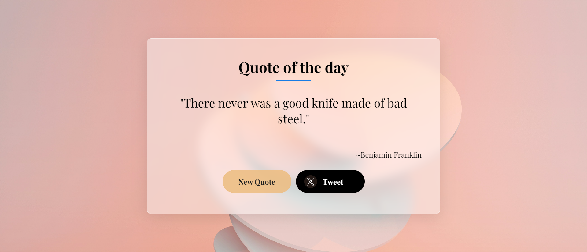

# Quote Generator

## Description

The Quote Generator is a simple web application that generates random quotes for users. It fetches quotes from an external API and displays them on the webpage. Users can click a button to generate a new random quote or share the current quote on Twitter.

## Features

- Generates random quotes from an external API.
- Displays the generated quote and its author on the webpage.
- Allows users to generate a new random quote with the click of a button.
- Provides the option to share the current quote on Twitter.

## Technologies Used

- HTML
- CSS
- JavaScript

## Usage

To use the Quote Generator, follow these steps:

1. Clone this repository to your local machine.
2. Open the `index.html` file in your web browser.
3. Click the "New Quote" button to generate a new random quote.
4. Click the "Tweet" button to share the current quote on Twitter.

## Credits

- Quote API: [Quotable API](https://api.quotable.io/)

## Contributing

If you would like to contribute to this project, please follow these steps:

1. Fork the repository.
2. Create a new branch (`git checkout -b feature/new-feature`).
3. Make your changes.
4. Commit your changes (`git commit -m 'Add new feature'`).
5. Push to the branch (`git push origin feature/new-feature`).
6. Create a new Pull Request.

